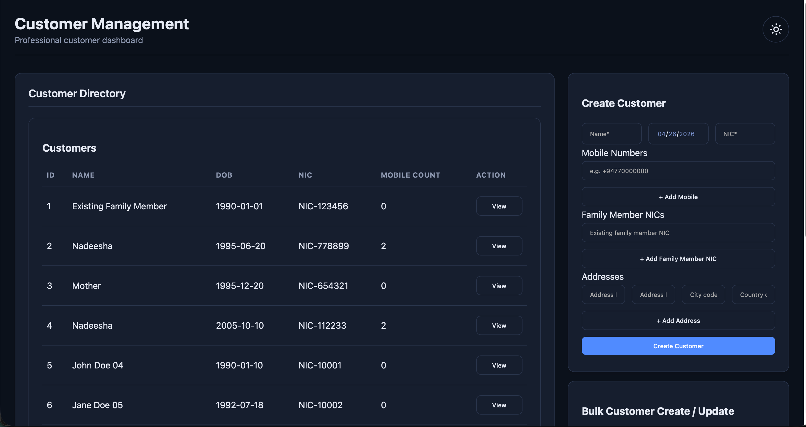

# Customer Management Platform

A professional full-stack **Customer Management System** implemented with:

- Java 8
- Spring Boot microservices
- MariaDB
- JUnit
- React JS
- Axios
- Maven
- Docker / Docker Compose

## Application UI Screenshot



## 1) Solution Overview

This project is built as a microservices-based platform with a modern React UI.

### Services

- `customer-service` (port `8081`)
  - Customer CRUD
  - Family-member relationship handling
  - Address handling with city/country master references
  - Internal bulk upsert API for import pipeline
- `import-service` (port `8082`)
  - Receives `.xlsx` uploads
  - Streams Excel parsing using Apache POI SAX/event model
  - Batches records and forwards to `customer-service`
- `frontend` (port `5173` via container port 80)
  - Dark-theme professional UI
  - Create / Update customer
  - View customer details
  - Table view of customers
  - Bulk import panel
- `mariadb` (port `3306`)
  - Schema and master data bootstrap from SQL scripts

## 2) Repository Structure

```text
customer_management_platform/
  backend/
    pom.xml
    customer-service/
    import-service/
  frontend/
  database/
    ddl/
    dml/
  docker-compose.yml
  README.md
```

## 3) Documentation Suite

- API contract (OpenAPI): `docs/openapi.yaml`
- API contract (detailed guide): `docs/api-contract.md`
- Postman collection: `docs/postman/customer_management_platform.postman_collection.json`
- Postman environment: `docs/postman/customer_management_platform.postman_environment.json`
- Documentation index: `docs/README.md`

## 4) Domain Model

A `Customer` has:

- `name` (mandatory)
- `dateOfBirth` (mandatory)
- `nicNumber` (mandatory, unique)
- `mobileNumbers` (0..n)
- `familyMembers` (0..n, references other customers)
- `addresses` (0..n)
  - `addressLine1`
  - `addressLine2`
  - `cityCode` / `countryCode` (master data backed)

Master data is stored in:

- `cities`
- `countries`

These are maintained in DB and not exposed as dedicated frontend screens.

## 5) Database Scripts

- DDL: `database/ddl/01_schema.sql`
- DML: `database/dml/01_master_data.sql`

The compose setup mounts these into MariaDB initialization directories.

### Seeded master data (city/country codes)

`cityCode` and `countryCode` used by customer addresses must exist in the master tables.

Seeded by `database/dml/01_master_data.sql`:

| Type | Code | Name |
|---|---|---|
| Country | `LK` | Sri Lanka |
| Country | `IN` | India |
| Country | `US` | United States |
| City | `CMB` | Colombo |
| City | `KDY` | Kandy |
| City | `JFN` | Jaffna |
| City | `BLR` | Bengaluru |

If an unknown `cityCode` or `countryCode` is sent, `customer-service` returns `400 Bad Request`.

## 6) API Reference

### customer-service public APIs

Base URL: `http://localhost:8081`

- `POST /api/customers` - create customer
- `PUT /api/customers/{id}` - update customer
- `GET /api/customers/{id}` - view single customer
- `GET /api/customers?page=0&size=20` - paginated table list

### customer-service internal API

- `POST /internal/customers/bulk-upsert`

Payload:

```json
{
  "customers": [
    {
      "name": "John Doe",
      "dateOfBirth": "1990-01-10",
      "nicNumber": "NIC-10001"
    }
  ]
}
```

### import-service API

Base URL: `http://localhost:8082`

- `POST /api/import/customers?batchSize=1000` (multipart form-data)
  - field: `file` (`.xlsx`)
  - expected columns in first sheet:
    - `name`
    - `date_of_birth` (`yyyy-MM-dd` or `M/d/yyyy`)
    - `nic_number`

Response example:

```json
{
  "rowsRead": 1000,
  "rowsAccepted": 997,
  "rowsRejected": 3,
  "created": 900,
  "updated": 97
}
```

## 7) Bulk Import Scaling Notes (1,000,000 rows)

To keep memory usage stable and avoid request overload:

- Uses Apache POI event streaming parser (not full workbook object graph for reading)
- Processes rows in batches (`100` to `5000`, default `1000`)
- Sends chunked upsert calls to `customer-service`
- Uses configured HTTP connect/read timeouts between services
- Performs deduplicated NIC lookup in each upsert batch to reduce DB round trips

Recommended production hardening for very large files:

- Move to async job model (queue + job table + progress endpoint)
- Use gzip upload and object storage staging
- Add retry/backoff and idempotency keys
- Tune DB indexes and pool sizes for sustained throughput

## 8) Run with Docker (Recommended)

```bash
cd /Users/nadeesha_medagama/IdeaProjects/customer_management_platform
docker compose up --build -d
```

Access:

- Frontend: `http://localhost:5173`
- Customer API: `http://localhost:8081`
- Import API: `http://localhost:8082`
- MariaDB: `localhost:3306`

Stop:

```bash
cd /Users/nadeesha_medagama/IdeaProjects/customer_management_platform
docker compose down
```

## 9) Run Locally Without Docker

Use three separate terminals so both backend services and the frontend run in parallel.

### Prerequisites

- MariaDB must be running on `localhost:3306`.
- Database `customer_db` and user credentials must match the values below.
- Schema and master data should be loaded from:
  - `database/ddl/01_schema.sql`
  - `database/dml/01_master_data.sql`

### Terminal 1 - customer-service

```bash
cd /Users/nadeesha_medagama/IdeaProjects/customer_management_platform/backend
export DB_URL="jdbc:mariadb://localhost:3306/customer_db"
export DB_USER="cmp_user"
export DB_PASSWORD="cmp_password"
mvn -pl customer-service spring-boot:run
```

### Terminal 2 - import-service

```bash
cd /Users/nadeesha_medagama/IdeaProjects/customer_management_platform/backend
export CUSTOMER_SERVICE_BULK_URL="http://localhost:8081/internal/customers/bulk-upsert"
mvn -pl import-service spring-boot:run
```

### Terminal 3 - frontend

```bash
cd /Users/nadeesha_medagama/IdeaProjects/customer_management_platform/frontend
npm install
npm run dev
```

Access after startup:

- Frontend: `http://localhost:5173`
- Customer API: `http://localhost:8081`
- Import API: `http://localhost:8082`

## 10) Testing

### Backend contract tests with Jest (Node.js)

These tests verify critical backend contracts and data integrity guarantees, including:

- Required backend API routes in `docs/openapi.yaml`
- Mandatory customer request fields and bulk import limits
- Key SQL constraints in `database/ddl/01_schema.sql` (NIC uniqueness, mandatory identity fields, family-link integrity)
- Internal import-to-customer-service wiring in `docker-compose.yml`

Run from repository root:

```bash
cd /Users/nadeesha_medagama/IdeaProjects/customer_management_platform
npm install
npm test
```

- Backend unit/integration tests:

```bash
cd /Users/nadeesha_medagama/IdeaProjects/customer_management_platform/backend
mvn -q test
```

- Frontend production build:

```bash
cd /Users/nadeesha_medagama/IdeaProjects/customer_management_platform/frontend
npm install --silent
npm run build --silent
```

## 11) Key Design Decisions

- Kept architecture as two backend microservices to separate core customer management from heavy file ingestion concerns.
- Used free and stable open-source dependencies only (Spring Boot, Apache POI, React, Axios, MariaDB).
- Added master-data based city/country references to minimize UI complexity and centralize consistency.
- Added internal bulk upsert endpoint to reduce DB calls for import operations.
- Delivered dark theme with a clean, professional UI layout and responsive behavior.

## 12) Sample Customer Create Request

```json
{
  "name": "Nadeesha",
  "dateOfBirth": "1995-06-20",
  "nicNumber": "NIC-778899",
  "mobileNumbers": ["+94771234567", "+94770000000"],
  "familyMemberNics": ["NIC-123456"],
  "addresses": [
    {
      "addressLine1": "No 12, Main Street",
      "addressLine2": "Ward Place",
      "cityCode": "CMB",
      "countryCode": "LK"
    }
  ]
}
```

## 13) Notes

- For first-time family-member linking, create those referenced family customers first.
- Frontend supports selecting a customer from table and updating via same form.
- Import service supports create/update behavior by NIC match.

## 14) Postman Quick Check (Create + See City/Country)

Use:

- Collection: `docs/postman/customer_management_platform.postman_collection.json`
- Environment: `docs/postman/customer_management_platform.postman_environment.json`

### 1. Create customer with valid city/country codes

- Method: `POST`
- URL: `{{customer_service_base}}/api/customers` (or `http://localhost:8081/api/customers`)
- Header: `Content-Type: application/json`
- Body (raw JSON):

```json
{
  "name": "Nadeesha",
  "dateOfBirth": "1995-06-20",
  "nicNumber": "NIC-778899",
  "mobileNumbers": ["+94771234567", "+94770000000"],
  "familyMemberNics": [],
  "addresses": [
    {
      "addressLine1": "No 12, Main Street",
      "addressLine2": "Ward Place",
      "cityCode": "CMB",
      "countryCode": "LK"
    }
  ]
}
```

Expected: `200 OK` and response contains `addresses[].cityCode`/`countryCode` plus resolved names.

### 2. See created record in list API

- Method: `GET`
- URL: `{{customer_service_base}}/api/customers?page=0&size=20`

Check response `content[]` item for your `nicNumber` and verify:

- `addresses[].cityCode = CMB`
- `addresses[].city = Colombo`
- `addresses[].countryCode = LK`
- `addresses[].country = Sri Lanka`

### 3. Negative test (invalid master code)

Resend create request with invalid codes, for example `cityCode: "XXX"`.

Expected: `400 Bad Request` with an error message indicating invalid address master data.

## 15) Closing Notes

This project is ready for local development and API verification with Postman using the documented master data codes.

For a smooth workflow:

- Start `customer-service` before `import-service`.
- Keep DB seed data intact (`cities` and `countries`) for address validation.
- Use the provided Postman collection/environment for quick regression checks.
- Run backend and frontend tests before packaging or deployment.

Thank you for using the Customer Management Platform.

